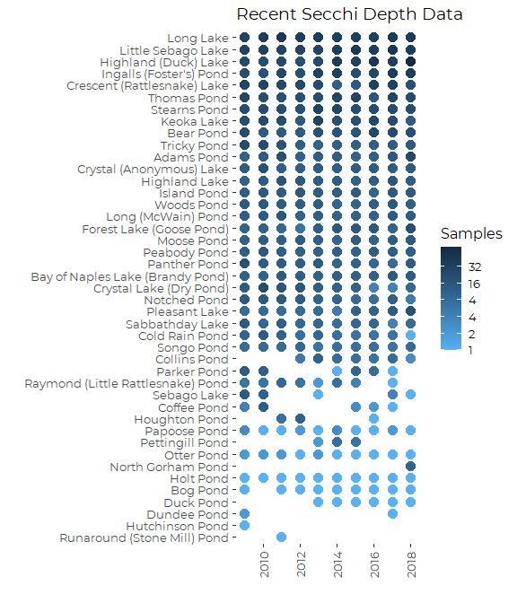
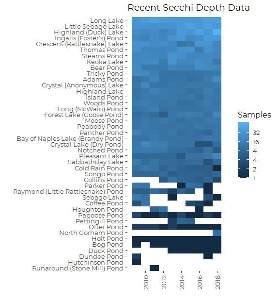
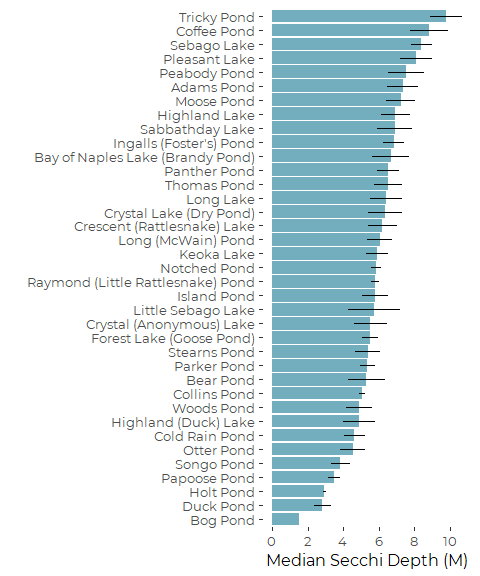
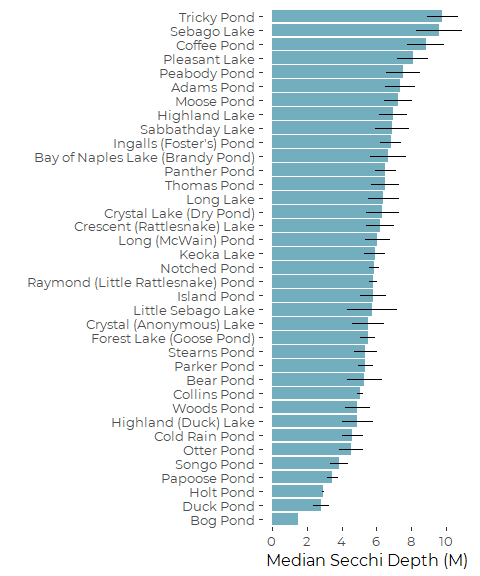
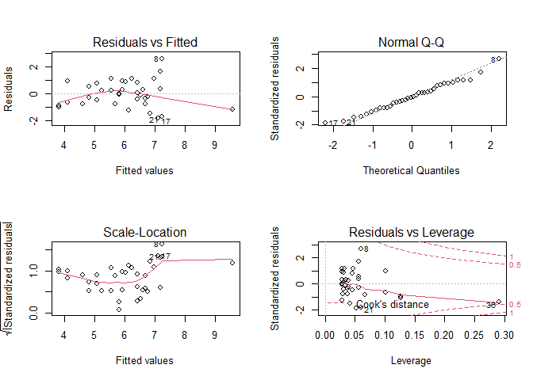
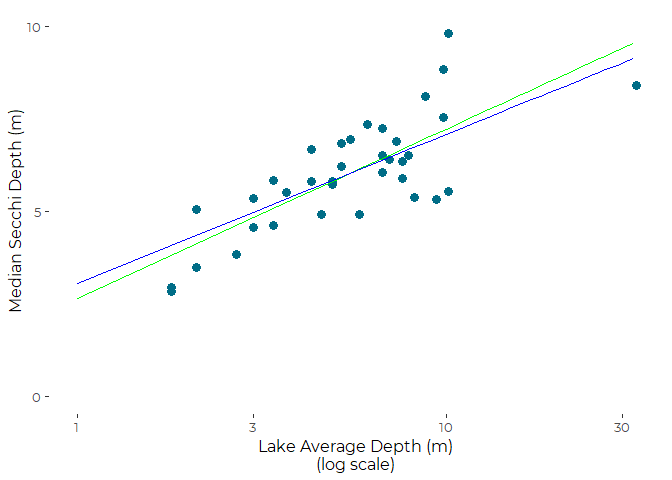
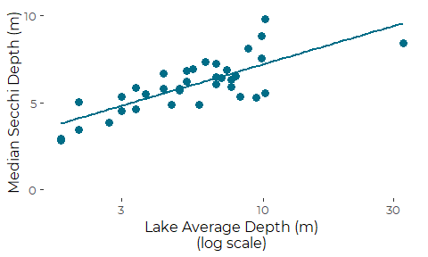

Graphics For Recent Lake Secchi Depths
================
Curtis C. Bohlen, Casco Bay Estuary Partnership
11/29/2020

  - [Load Libraries](#load-libraries)
  - [Load Data](#load-data)
      - [Folder References](#folder-references)
          - [Read Secchi Data](#read-secchi-data)
          - [Data Cleanup](#data-cleanup)
          - [Filter to Last Ten Years](#filter-to-last-ten-years)
      - [Read Morphometric Data](#read-morphometric-data)
      - [Lakes With Sufficient Data](#lakes-with-sufficient-data)
          - [Graphic of Data by Year](#graphic-of-data-by-year)
          - [List Ponds with Enough Data](#list-ponds-with-enough-data)
      - [Construct Recent Lake
        Summaries](#construct-recent-lake-summaries)
  - [Graphics](#graphics)
      - [Bar Chart](#bar-chart)
      - [Violin Plot](#violin-plot)
  - [Correlations Between Secchi Depth and Lake
    Morphology](#correlations-between-secchi-depth-and-lake-morphology)
  - [Showing Relationships
    Graphically](#showing-relationships-graphically)
      - [Water Clarity and Mean Depth](#water-clarity-and-mean-depth)
          - [Linear Regression](#linear-regression)
          - [Related Plot](#related-plot)
      - [Secchi by Location (and Depth)](#secchi-by-location-and-depth)


# Load Libraries

``` r
library(tidyverse)
```

    ## -- Attaching packages ---------------------------------------------------------------------------------- tidyverse 1.3.0 --

    ## v ggplot2 3.3.2     v purrr   0.3.4
    ## v tibble  3.0.3     v dplyr   1.0.2
    ## v tidyr   1.1.2     v stringr 1.4.0
    ## v readr   1.3.1     v forcats 0.5.0

    ## -- Conflicts ------------------------------------------------------------------------------------- tidyverse_conflicts() --
    ## x dplyr::filter() masks stats::filter()
    ## x dplyr::lag()    masks stats::lag()

``` r
#library(readxl)
#library(readr)

library(CBEPgraphics)
load_cbep_fonts()
theme_set(theme_cbep())
```

# Load Data

Here we read in the data, do a lot of renaming, and convert some to
factors, and finally, add a Year term. Note the filter removing NAs is
because one lake is included in these data but has no actual data – only
NAs for the Secchi Depth.

## Folder References

``` r
sibfldnm <- 'Derived_Data'
parent <- dirname(getwd())
sibling <- file.path(parent,sibfldnm)
fn <- 'Secchi.csv'


dir.create(file.path(getwd(), 'figures'), showWarnings = FALSE)
```

### Read Secchi Data

``` r
secchi_data <- read_csv(file.path(sibling, fn))
```

    ## Parsed with column specification:
    ## cols(
    ##   MIDAS = col_double(),
    ##   Lake = col_character(),
    ##   Town = col_character(),
    ##   Station = col_double(),
    ##   Date = col_datetime(format = ""),
    ##   Time = col_character(),
    ##   Secchi_Depth = col_double(),
    ##   Secchi_On_Bottom = col_character(),
    ##   Scope = col_double(),
    ##   Wind_Level = col_double(),
    ##   Wind_Direction = col_double(),
    ##   Cloud_Cover = col_character()
    ## )

    ## Warning: 9 parsing failures.
    ##  row   col expected actual                                                                                                                              file
    ## 1598 Scope a double      N 'C:/Users/curtis.bohlen/Documents/State of the Bay 2020/Data/A5. Inland Water Quality/Lake_Water_Quality/Derived_Data/Secchi.csv'
    ## 1599 Scope a double      N 'C:/Users/curtis.bohlen/Documents/State of the Bay 2020/Data/A5. Inland Water Quality/Lake_Water_Quality/Derived_Data/Secchi.csv'
    ## 1600 Scope a double      N 'C:/Users/curtis.bohlen/Documents/State of the Bay 2020/Data/A5. Inland Water Quality/Lake_Water_Quality/Derived_Data/Secchi.csv'
    ## 1601 Scope a double      N 'C:/Users/curtis.bohlen/Documents/State of the Bay 2020/Data/A5. Inland Water Quality/Lake_Water_Quality/Derived_Data/Secchi.csv'
    ## 1602 Scope a double      N 'C:/Users/curtis.bohlen/Documents/State of the Bay 2020/Data/A5. Inland Water Quality/Lake_Water_Quality/Derived_Data/Secchi.csv'
    ## .... ..... ........ ...... .................................................................................................................................
    ## See problems(...) for more details.

Eight of nine parsing errors are for Scope == “N”, Songo pond, (MIDAS =
3262), for every observation in 2011. We decided that “N” here probably
meant no scope was used, so Scope == 1 (or, Scope = “None”, after
conversion to factor) is appropriate. We wil fix that after we add a
“Year” value to the data.

The ninth parsing error was for an observation from Woods Pond, in June
of 1997, where scope was recorded as “L”. Surrounding values had Scope
== 2 and Scope == 5, so we leave that value as missing.

### Data Cleanup

Here we convert some values to factors, and add Year and month terms.

  - The “Scope” data contains a sixth value Scope == 6, that is not
    referenced in the source Metadata. We declare it as “Undefined”,
    pending clarification from DEP of the lakes monitoring community.
    Ifwe need this information, it may be defined in the Maine Volunteer
    Lakes Monitoring QAPP ore related SOPs. A quick search of online
    documents found the QAPP, but not the SOPs.

  - We filter out NAs is because one lake is included in the data but
    has no actual Secchi data, and it prevents the lake from being
    carried forward.

  - We convert the Lake name to a factor, ordered by meedian Secchi
    Depth.

  - Coding for the “Secchi\_on\_Bottom” flag is inconsistent, with four
    possible codes: “Y”, “B”, “N”, and "“. We interpret the first two as
    evidence that the Secchi Disk was on the bottom,”N" as evidence that
    it was not, and "" as a missing value.

<!-- end list -->

``` r
secchi_data <- secchi_data %>%
  rename(CensoredFlag = Secchi_On_Bottom) %>%
  mutate(CensoredFlag = fct_recode(CensoredFlag, 'Y'='B')) %>%
  mutate(CensoredFlag = CensoredFlag == 'Y') %>%
           
  mutate(Scope = factor(Scope, levels = as.character(1:6),
                        labels = c('None', 'Plain', 'Slant', 'Slant with Mask', 'Flat with Mask', 'Undefined'))) %>%
  rename(Wind_mph = Wind_Level) %>%
  rename(WindDir = Wind_Direction ) %>%
  mutate(WindDir = factor (WindDir, levels = 1:8, labels = c('N', 'NE', 'E', 'SE', 'S', 'Sw', 'W', 'NW'))) %>%
  rename(CloudCover = Cloud_Cover) %>%
  mutate(CloudCover = factor (CloudCover, levels = c('B', 'C', 'O'),
                              labels = c('Clear', 'Cloudy Bright' , 'Heavy Overcast'))) %>%
 
  mutate(Year = as.numeric(format(Date, format = '%Y'))) %>%
  mutate(Month = as.numeric(format(Date, format = '%m'))) %>%
  mutate(Month = factor(Month, levels = 1:12, labels = month.abb)) %>%
  
  mutate(Lake = fct_reorder(factor(Lake), Secchi_Depth)) %>%
  
  filter( ! is.na(Secchi_Depth)) 

  # Correct Parsing Errors
  secchi_data$Scope[secchi_data$MIDAS == 3262 & secchi_data$Year == 2011] <- 'None'
```

### Filter to Last Ten Years

``` r
secchi_data <- secchi_data %>% filter(Year > 2008)
```

## Read Morphometric Data

Read in morphometric data, and filter to lakes for which we have at
least some Secchi data.

``` r
fn <- 'Lake_Morphometry_Metric.csv'
morpho.data <- read_csv(file.path(sibling, fn))
```

    ## Parsed with column specification:
    ## cols(
    ##   .default = col_double(),
    ##   Lake = col_character(),
    ##   Towns = col_character(),
    ##   Trop_Cat = col_character(),
    ##   Dam = col_character(),
    ##   Major_Drainage = col_character(),
    ##   Sub_Drainage = col_character(),
    ##   HUC10_Name = col_character(),
    ##   USGS_Quad24 = col_character(),
    ##   County = col_character(),
    ##   WQ_Statement = col_character(),
    ##   Invasives = col_character(),
    ##   Fishery = col_character()
    ## )

    ## See spec(...) for full column specifications.

``` r
#rm(fn,parent,sibfldnm,sibling)
```

## Lakes With Sufficient Data

### Graphic of Data by Year

``` r
secchi_data %>%
  group_by(MIDAS, Year) %>%
  summarize(Lake = first(Lake),
            Sampled = sum(! is.na(Secchi_Depth)),
            .groups = 'drop_last') %>%
 #mutate(MIDAS2 = fct_reorder(factor(MIDAS), Sampled, sum)) %>%
  ggplot(aes(x = Year, y= fct_reorder(Lake, Sampled, sum), color = log(Sampled,2))) +
  geom_point(size = 3.5) +
  theme_cbep(base_size = 12) +
  theme(axis.text.x = element_text(angle = 90, vjust = .5)) +
  scale_colour_gradient(  high = "#132B43", low = "#56B1F7",
                          breaks = c(0, 1, 2, 3, 4, 5),
                          labels = c(1, 2, 4, 4, 16, 32),
                          name = 'Samples') +
  ylab('') +
  xlab('') +
  ggtitle('Recent Secchi Depth Data')
```

<!-- -->

``` r
secchi_data %>%
  group_by(MIDAS, Year) %>%
  summarize(Lake = first(Lake),
            Sampled = sum(! is.na(Secchi_Depth)),
            .groups = 'drop_last') %>%
 #mutate(MIDAS2 = fct_reorder(factor(MIDAS), Sampled, sum)) %>%
  ggplot(aes(x = Year, y= fct_reorder(Lake, Sampled, sum), fill = log(Sampled,2))) +
  geom_raster() +
  theme_cbep(base_size = 12) +
  theme(axis.text.x = element_text(angle = 90, vjust = .5)) +
  scale_fill_gradient(breaks = c(0, 1, 2, 3, 4, 5),
                          labels = c(1, 2, 4, 4, 16, 32),
                          name = 'Samples') +
  scale_x_continuous(breaks = c(2010, 2012, 2014, 2016, 2018)) +
  ylab('') +
  xlab('') +
  ggtitle('Recent Secchi Depth Data')
```

<!-- -->

``` r
ggsave('figures/current_secchi_data_availability.pdf', device = cairo_pdf, width = 7, height = 8)
```

Most ponds have reasonable sampling histories over the last ten years.
Only Runaround Pond, Hutchins Pond, and Dundee Pond and North Gorham
Pond do not.

### List Ponds with Enough Data

``` r
RecentLakesMIDAS <- secchi_data %>%
  filter(Year > 2008) %>%
  group_by(MIDAS, Year) %>%
  summarize(Lake = first(Lake),
            Sampled = sum(! is.na(Secchi_Depth)),
            .groups = 'drop_last') %>%
  summarize(Lake = first(Lake),
            nsamples = sum(Sampled),
            nyears = sum(Sampled > 0),
            .groups = 'drop_last') %>%
  filter(nsamples > 4,
         nyears > 4 ) %>%
  arrange(-nsamples) %>%
  pull(MIDAS)
```

## Construct Recent Lake Summaries

Note that this IGNORES different sampling locations (“Stations”) on some
lakes. We don’t need these data frames internally, as we construct
graphics using `stat_summary()`. The Lakes version is valuable for
export to GIS.

``` r
recent_station <- secchi_data %>%
  filter(MIDAS %in% RecentLakesMIDAS) %>%
  mutate(MIDAS = factor(MIDAS)) %>%
  group_by(MIDAS, Station) %>%
  summarize(Mean    =  mean(Secchi_Depth, na.rm = TRUE),
            Median  =  median(Secchi_Depth, na.rm = TRUE),
            SD      =  sd(Secchi_Depth, na.rm = TRUE),
            N       =  sum(! is.na(Secchi_Depth)),
            SE      =  SD /sqrt(N),
            .groups = 'drop') %>%
  mutate(MIDAS2 = fct_reorder(MIDAS, Median),
         Lake2  = fct_reorder(MIDAS, Median))
```

``` r
recent_lake <- secchi_data %>%
  filter(MIDAS %in% RecentLakesMIDAS) %>%
  mutate(MIDAS = factor(MIDAS)) %>%
  group_by(MIDAS) %>%
  summarize(Mean    =  mean(Secchi_Depth, na.rm = TRUE),
            Median  =  median(Secchi_Depth, na.rm = TRUE),
            SD      =  sd(Secchi_Depth, na.rm = TRUE),
            MAD     =  mad(Secchi_Depth, na.rm = TRUE),
            N       =  sum(! is.na(Secchi_Depth)),
            SE      =  SD /sqrt(N),
            .groups = 'drop')
  
write.csv(recent_lake, 'RecentSecchiSummary.csv')   # Output convenient for GIS

recent_lake <- recent_lake %>%
  mutate(MIDAS2 = fct_reorder(MIDAS, Median),
         Lake2  = fct_reorder(MIDAS, Median))
```

# Graphics

Note that Secchi Depth is right censored data, with censoring shown by
the CensoredFlag. Here, we ignore this constraint, by focusing on median
Secchi depths. A median is robust to left censored values, with a
breakdown point of 50%. A quick check of our data ( see the figures,
below) shows that none of the lakes has a median close to the minimum
Secchi depth, so the median should be fairly robust.

We see several lakes where the lower limit on Secchi depth is abrupt,
suggesting right censored (and in some cases, left censored) values, but
the median is never near the limits of the distribution. The median is
an appropriate statistic of location for these data.

## Bar Chart

This first plot is a simple bar chart of Median Secchi depths +/- one
median absolute deviation, observed over past 10 years.

``` r
plt <- secchi_data %>%
  filter( MIDAS %in% RecentLakesMIDAS) %>%
  ggplot(aes(fct_reorder(Lake, Secchi_Depth), Secchi_Depth)) + 
  stat_summary(geom = 'col', fun = median, fill = cbep_colors()[6]) + 
  stat_summary(geom = 'linerange',
               fun.min = function(.x) {
                 median(.x, na.rm= TRUE) - mad(.x, na.rm = FALSE) },
               fun.max = function(.x) {
                 median(.x, na.rm= TRUE) + mad(.x, na.rm = FALSE) }) + 

  ylab('Median Secchi Depth (M)') +
  xlab('') +
  
  theme_cbep(base_size = 12) +
  scale_y_continuous(breaks = (0:5)*2) +
  
  coord_flip()
plt
```

<!-- -->

``` r
ggsave('figures/current_secchi_bar.pdf', device = cairo_pdf,
       width = 5, height = 6)
```

## Violin Plot

This second plot is a violin plot alternative

``` r
plt <- secchi_data %>%
  filter(MIDAS %in% RecentLakesMIDAS) %>%
  
  ggplot(aes(x=fct_reorder(Lake, Secchi_Depth), y=Secchi_Depth)) +
  geom_violin(scale='width', fill = cbep_colors()[6]) +
  stat_summary(geom = 'point', fun = median,
             pch = 19) +
  
  ylab('Median Secchi Depth (M)') +
  xlab('') +
  
  theme_cbep(base_size = 12) +
  
  coord_flip()
plt
```

<!-- -->

``` r
ggsave('figures/current_secchi_violin.pdf', device = cairo_pdf,
       width = 5, height = 6)
```

# Correlations Between Secchi Depth and Lake Morphology

We can compare recent median water clarity to potential explanatory
morphometric variables.

``` r
tmp <- morpho.data %>%
  filter(MIDAS %in% RecentLakesMIDAS) %>%
  mutate(WS_Ratio = TDrain_ha/(Area_sq_m/10000),
         Median   = recent_lake$Median[match(MIDAS, recent_lake$MIDAS)],
         Samples  = recent_lake$N[match(MIDAS, recent_lake$MIDAS)]) %>%
  select(where(is.numeric)) %>%
rename(Easting = UTM_X,
       Northing = UTM_Y)

cat('Pearson\n')
```

    ## Pearson

``` r
cor(tmp$Median, tmp[,2:12], use = 'pairwise')
```

    ##      Flushes_p_yr HUC10_Code   Easting   Northing   Latitude Longitude
    ## [1,]   -0.3210285 -0.0792604 0.2344622 -0.3762106 -0.3536981 0.2343718
    ##      Area_sq_m  Perim_km  D_Mean_m   D_Max_m Volume_m3
    ## [1,] 0.2870965 0.3162291 0.5788747 0.4888161 0.2623607

``` r
cat('\n\nSpearman\n')
```

    ## 
    ## 
    ## Spearman

``` r
cor(tmp$Median, tmp[,2:12], use = 'pairwise', method='spearman')
```

    ##      Flushes_p_yr HUC10_Code   Easting Northing   Latitude Longitude Area_sq_m
    ## [1,]   -0.6910449 -0.1108531 0.2048486 -0.27977 -0.2650702 0.1983285 0.4860988
    ##       Perim_km  D_Mean_m   D_Max_m Volume_m3
    ## [1,] 0.5050104 0.7066025 0.6213781 0.5715941

``` r
cat('\n\nKendall\n')
```

    ## 
    ## 
    ## Kendall

``` r
cor(tmp$Median, tmp[,2:12], use = 'pairwise', method='kendall')
```

    ##      Flushes_p_yr HUC10_Code   Easting   Northing   Latitude Longitude
    ## [1,]   -0.5454573 -0.1015026 0.1337341 -0.1607814 -0.1577762 0.1247183
    ##      Area_sq_m  Perim_km D_Mean_m   D_Max_m Volume_m3
    ## [1,] 0.3536495 0.3758517 0.555403 0.4844201 0.4114378

Basically, that shows:

1.  larger lakes, especially deeper lakes, have clearer water, but the
    relationships are not simply linear, or the Pearson and Spearman
    Coefficients would be more similar.  
2.  Lakes with higher flushing rates tend to have poorer water clarity.
    That probably reflect the fact that smaller lakes have smaller
    volumes, and thus higher flushing rates.

# Showing Relationships Graphically

``` r
tmp2 <- tmp %>% select(Area_sq_m, Perim_km,
                       D_Mean_m, D_Max_m,
                       Flushes_p_yr, Median, Samples)%>%
  rename(Secchi = Median) %>%
  rename_at(1:5, ~ c('A', 'P', 'DAvg', 'DMax', 'Flushing Rate'))

tmp3 <- tmp2 %>% 
  pivot_longer(-c(Secchi, Samples), names_to = "Type", values_to = "Value" ) %>%
  mutate(Type = factor(Type, levels = c('A', 'P',
                                          'DAvg', 'DMax',
                                          'Flushing Rate')))

plt <- ggplot(tmp3, aes(Value, Secchi)) +
  geom_point() +
  geom_smooth(method = 'lm') +
    scale_x_log10() +
    facet_wrap(~Type, nrow=2, scales = "free_x")
plt
```

    ## `geom_smooth()` using formula 'y ~ x'

    ## Warning: Removed 3 rows containing non-finite values (stat_smooth).

    ## Warning: Removed 3 rows containing missing values (geom_point).

<!-- -->

``` r
  rm(tmp3)
```

So, for all of our measures of lake size, a log linear relationship is
pretty good, with the two measures of depth the best fit.

## Water Clarity and Mean Depth

### Linear Regression

``` r
the_lm <- lm(Secchi~ DAvg, data = tmp2)
summary(the_lm)
```

    ## 
    ## Call:
    ## lm(formula = Secchi ~ DAvg, data = tmp2)
    ## 
    ## Residuals:
    ##     Min      1Q  Median      3Q     Max 
    ## -2.3639 -0.8631  0.0462  0.8097  3.1846 
    ## 
    ## Coefficients:
    ##             Estimate Std. Error t value Pr(>|t|)    
    ## (Intercept)  4.87352    0.34339  14.192 7.56e-16 ***
    ## DAvg         0.17246    0.04166   4.139 0.000217 ***
    ## ---
    ## Signif. codes:  0 '***' 0.001 '**' 0.01 '*' 0.05 '.' 0.1 ' ' 1
    ## 
    ## Residual standard error: 1.266 on 34 degrees of freedom
    ##   (1 observation deleted due to missingness)
    ## Multiple R-squared:  0.3351, Adjusted R-squared:  0.3155 
    ## F-statistic: 17.14 on 1 and 34 DF,  p-value: 0.0002167

``` r
anova(the_lm)
```

    ## Analysis of Variance Table
    ## 
    ## Response: Secchi
    ##           Df Sum Sq Mean Sq F value    Pr(>F)    
    ## DAvg       1 27.460 27.4597  17.135 0.0002167 ***
    ## Residuals 34 54.486  1.6025                      
    ## ---
    ## Signif. codes:  0 '***' 0.001 '**' 0.01 '*' 0.05 '.' 0.1 ' ' 1

``` r
oldpar <- par(mfrow = c(2,2))
plot(the_lm)
```

<!-- -->

``` r
par(oldpar)
```

Lake 36, Sebago Lake, is a outlier, high leverage, and high Cook’s
Distance. This is not an especially good model.

``` r
the_log_lm <- lm(Secchi~ log(DAvg), data = tmp2)
summary(the_log_lm)
```

    ## 
    ## Call:
    ## lm(formula = Secchi ~ log(DAvg), data = tmp2)
    ## 
    ## Residuals:
    ##      Min       1Q   Median       3Q      Max 
    ## -1.78737 -0.77170 -0.03651  0.78762  2.55949 
    ## 
    ## Coefficients:
    ##             Estimate Std. Error t value Pr(>|t|)    
    ## (Intercept)   2.6317     0.5055   5.206 9.28e-06 ***
    ## log(DAvg)     1.9930     0.2831   7.039 3.99e-08 ***
    ## ---
    ## Signif. codes:  0 '***' 0.001 '**' 0.01 '*' 0.05 '.' 0.1 ' ' 1
    ## 
    ## Residual standard error: 0.9904 on 34 degrees of freedom
    ##   (1 observation deleted due to missingness)
    ## Multiple R-squared:  0.593,  Adjusted R-squared:  0.5811 
    ## F-statistic: 49.54 on 1 and 34 DF,  p-value: 3.991e-08

``` r
anova(the_log_lm)
```

    ## Analysis of Variance Table
    ## 
    ## Response: Secchi
    ##           Df Sum Sq Mean Sq F value    Pr(>F)    
    ## log(DAvg)  1 48.597  48.597  49.545 3.991e-08 ***
    ## Residuals 34 33.349   0.981                      
    ## ---
    ## Signif. codes:  0 '***' 0.001 '**' 0.01 '*' 0.05 '.' 0.1 ' ' 1

``` r
oldpar <- par(mfrow = c(2,2))
plot(the_log_lm)
```

<!-- -->

``` r
par(oldpar)
```

Sebago is still somewhat of an outlier, but Cook’s Distance is under
0.5, and leverage is half as large, so this is a more reasonable model.
The model fits the smaller lakes substantially better.

``` r
weighted_log_lm <- lm(Secchi~ log(DAvg), weights = sqrt(Samples), data = tmp2)
summary(weighted_log_lm)
```

    ## 
    ## Call:
    ## lm(formula = Secchi ~ log(DAvg), data = tmp2, weights = sqrt(Samples))
    ## 
    ## Weighted Residuals:
    ##     Min      1Q  Median      3Q     Max 
    ## -6.1464 -1.8292 -0.2007  1.8998  9.4090 
    ## 
    ## Coefficients:
    ##             Estimate Std. Error t value Pr(>|t|)    
    ## (Intercept)   3.0521     0.6657   4.585 5.89e-05 ***
    ## log(DAvg)     1.7515     0.3637   4.816 2.97e-05 ***
    ## ---
    ## Signif. codes:  0 '***' 0.001 '**' 0.01 '*' 0.05 '.' 0.1 ' ' 1
    ## 
    ## Residual standard error: 3.239 on 34 degrees of freedom
    ##   (1 observation deleted due to missingness)
    ## Multiple R-squared:  0.4055, Adjusted R-squared:  0.388 
    ## F-statistic: 23.19 on 1 and 34 DF,  p-value: 2.971e-05

``` r
anova(weighted_log_lm)
```

    ## Analysis of Variance Table
    ## 
    ## Response: Secchi
    ##           Df Sum Sq Mean Sq F value    Pr(>F)    
    ## log(DAvg)  1 243.36 243.356  23.194 2.971e-05 ***
    ## Residuals 34 356.74  10.492                      
    ## ---
    ## Signif. codes:  0 '***' 0.001 '**' 0.01 '*' 0.05 '.' 0.1 ' ' 1

``` r
oldpar <- par(mfrow = c(2,2))
plot(weighted_log_lm)
```

<!-- -->

``` r
par(oldpar)
```

One can make a justification for a weighted model, here, since sample
sizes vary significantly. A weighted model brings the regression line
closer to Sebago because of its large sample size. Sebago no longer
appears as an outlier, although it still has the highest leverage of any
lake.

We have a highly significant regression relationship, regardless of
model. The weighted log analysis does the best job addressing Sebago
Lake, but the different fits provide similar predictions.

We can compare predictions for the two log regressions as follows:

``` r
df <- tibble(DAvg = 1:32)
df <- df %>%
  mutate(pred_log = predict(the_log_lm, newdata = df),
         pred_weight = predict(weighted_log_lm, newdata = df))

ggplot(tmp, aes(D_Mean_m, Median)) +
  geom_point(size=3, color = cbep_colors()[1]) +
  geom_line(aes(DAvg, pred_log), data = df, color = 'green') +
  geom_line(aes(DAvg, pred_weight), data = df, color = 'blue') +

  xlab('Lake Average Depth (m)\n(log scale)') +
  ylab('Median Secchi Depth (m)')  +
  theme_cbep(base_size = 12) +
  theme(panel.grid.major = element_blank(), panel.grid.minor = element_blank()) +
  scale_y_continuous(limits=c(0,10), breaks = c(0,5,10)) +
  scale_x_log10()
```

    ## Warning: Removed 1 rows containing missing values (geom_point).

<!-- -->

``` r
rm(df)
```

From a practical point of view, the two similar, and, for the State of
Casco Bay audience, the meaning of a graphic based on these two similar
regressions would be effectively indistinguishable. Using the weighted
regression would require more explanation, without changing meaning. In
the interest of parsimony, we chose to chose to present the unweighted
model.

### Related Plot

``` r
plt <- ggplot(tmp, aes(D_Mean_m, Median)) +
  geom_point(size=3, color = cbep_colors()[1]) +
  geom_smooth(method = 'lm', se = FALSE, color = cbep_colors()[1]) +

  xlab('Lake Average Depth (m)\n(log scale)') +
  ylab('Median Secchi Depth (m)')  +
  theme_cbep(base_size = 12) +
  theme(panel.grid.major = element_blank(), panel.grid.minor = element_blank()) +
  scale_y_continuous(limits=c(0,10), breaks = c(0,5,10)) +
  scale_x_log10()
plt
```

    ## `geom_smooth()` using formula 'y ~ x'

    ## Warning: Removed 1 rows containing non-finite values (stat_smooth).

    ## Warning: Removed 1 rows containing missing values (geom_point).

<!-- -->

``` r
ggsave('figures/current_secchi_by_depth.pdf', device = cairo_pdf,
width = 5, height = 3)
```

    ## `geom_smooth()` using formula 'y ~ x'

    ## Warning: Removed 1 rows containing non-finite values (stat_smooth).
    
    ## Warning: Removed 1 rows containing missing values (geom_point).

## Secchi by Location (and Depth)

``` r
plt <- tmp %>% 
  ggplot(aes(Easting,Northing, color = Median)) + 
  geom_point(aes(size=D_Mean_m)) +

  coord_fixed() +
  
  scale_color_gradient(high="khaki", low = "red4", name = 'Median\nSecchi (m)') +
  
  theme_cbep(base_size = 12) +
  theme(axis.text.x = element_text(angle = 25))
  
plt
```

    ## Warning: Removed 1 rows containing missing values (geom_point).

<!-- -->
